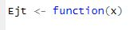
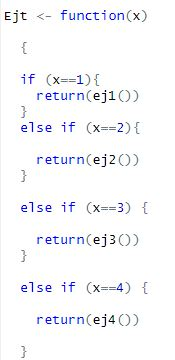
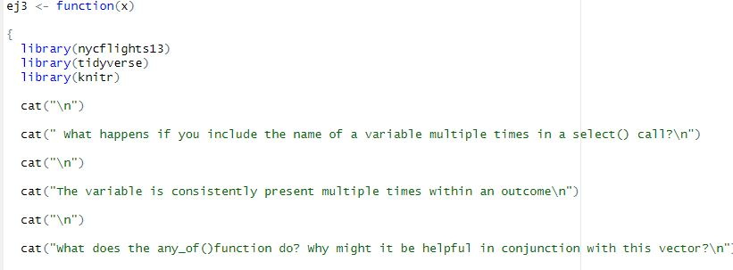
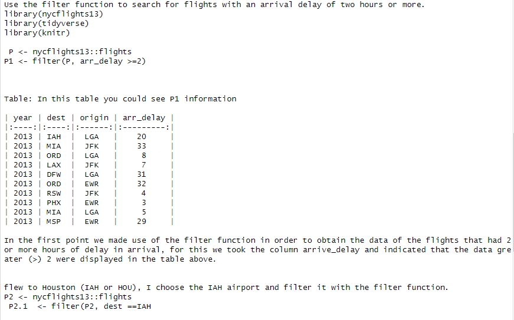

```{r setup, include=FALSE}
knitr::opts_chunk$set(echo = TRUE)
```

A main function was used to create the selector:



Inside this function there is a sequence of nested If, which will allow us to select the different options (1 to 6).



If the person does not select an option between 1-6, the system will display a message:

"Please select one option between 1 and 6".

Each section is made up of a function that contains each exercise:



The CAT function is used to print or concatenate several text arguments in the console or in an output file.


